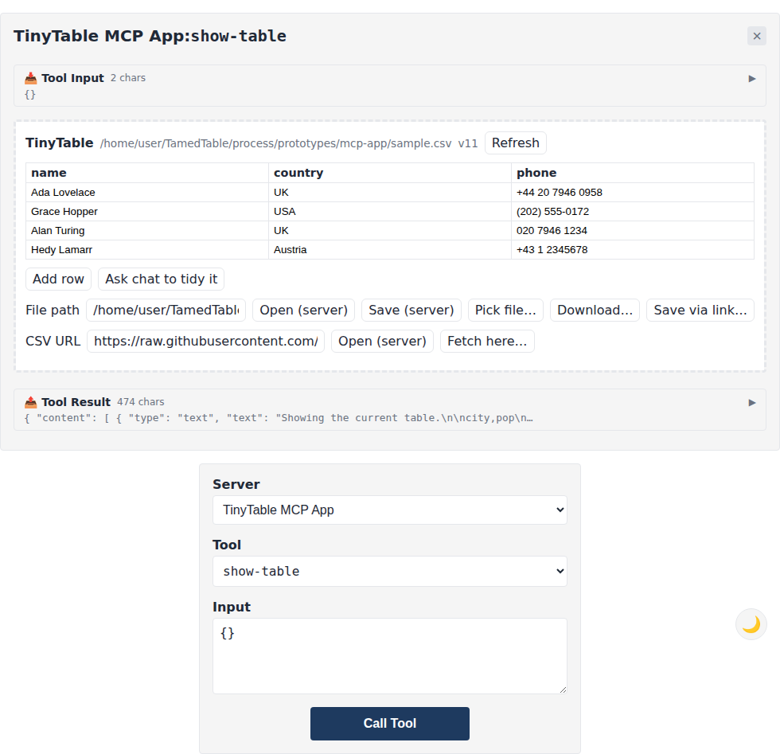

# TinyTable: an MCP App prototype

A learning prototype of the [MCP Apps extension](https://github.com/modelcontextprotocol/ext-apps) (SEP-1865, spec version `2026-01-26`). It shows a CSV table inside the chat, lets you edit cells in place, opens and saves files locally and over http(s), and lets you change the data by typing a request in the parent chat.

Nothing here feeds TamedTable's app. It lives under `marketing/` as a standalone demo: run it by hand, read [LEARNINGS.md](LEARNINGS.md).



## Run it on your own machine

```bash
cd marketing/mcp-app
bun install
bun run start          # builds the view, serves MCP on http://localhost:3001/mcp
                       # local runs set TINYTABLE_LOCAL_FILES=1, so file tools work
```

To drive it from a host you can click, use the reference host that ships with the SDK:

```bash
git clone --depth 1 https://github.com/modelcontextprotocol/ext-apps.git /tmp/ext-apps
cd /tmp/ext-apps/examples/basic-host && bun install && bun run build && bun serve.ts
# open http://localhost:8080, pick "show-table", press Call Tool
```

## Install into Claude Desktop

Claude Desktop launches the server itself over stdio, so it needs a path and nothing else. Settings, Developer, Edit Config:

```json
{
  "mcpServers": {
    "tinytable": {
      "command": "bun",
      "args": ["run", "--cwd", "/absolute/path/to/marketing/mcp-app", "start:stdio"]
    }
  }
}
```

`start:stdio` rebuilds the view before serving, so there is no separate build step. Restart Claude Desktop, then ask it to *"show the table"*.

Over stdio the server runs on your machine, so `open-table` and `save-table` read and write your disk.

## Install into claude.ai

It is already running at **https://tamedtable.onrender.com/mcp**. Paste that into claude.ai under **Settings**, **Connectors**, **Add custom connector**, and skip to [what changes on a public server](#what-changes-on-a-public-server).

claude.ai runs in Anthropic's cloud and cannot reach your laptop, so the server has to sit at a public https URL. The `Dockerfile` is the whole deployment: any container host will take it.

### Deploy your own copy to Render

1. Sign in at [render.com](https://render.com) with GitHub.
2. **New**, **Web Service**, pick the `TamedTable` repo.
3. Set **Root Directory** to `marketing/mcp-app`. Render sees the `Dockerfile` and switches **Language** to Docker by itself.
4. Leave the rest alone and **Deploy**. The first build takes a few minutes.
5. Open the URL it gives you. `Connect an MCP client to /mcp` means it is up.

### Point Claude at it

In claude.ai: **Settings**, **Connectors**, **Add custom connector**, and paste `https://your-service.onrender.com/mcp`.

Then ask *"show the table"*.

On Render's free plan the service sleeps after 15 idle minutes and takes about half a minute to wake, so the first message after a pause may time out. Ask again.

### What changes on a public server

- `open-table` and `save-table` refuse local paths, because the disk belongs to the host, not to you. http(s) URLs still work. Set `TINYTABLE_LOCAL_FILES=1` to switch them back on.

### Or run the image yourself

```bash
docker build -t tinytable marketing/mcp-app
docker run -p 8080:8080 tinytable
```

## What is where

| File | Holds |
|---|---|
| `server.ts` | The four tools and the one `ui://` resource |
| `table.ts` | CSV parse and write, and the edit ops. Pure functions, no state |
| `main.ts` | Transports: Streamable HTTP on :3001, or `--stdio` |
| `Dockerfile` | The image a container host runs for the claude.ai path |
| `mcp-app.html`, `src/mcp-app.ts`, `src/app.css` | The view, bundled to one file by `vite-plugin-singlefile` |

## The tools

Four tools, all visible to the model, all carrying the same `resourceUri` so any of them paints the view.

| Tool | Does |
|---|---|
| `show-table` | Displays a CSV, or the built-in sample |
| `edit-table` | `set-cell`, `add-row`, `delete-row`, `rename-column`, `sort`, `filter` |
| `open-table` | Reads a CSV from a local path or an http(s) URL |
| `save-table` | Writes a CSV to a local path |

The server keeps no table between calls. Each tool takes the current CSV and returns the new one, and the table itself lives in the view. [LEARNINGS.md](LEARNINGS.md) has the failure that forced this.

Edits made in the grid never reach the server. They are applied locally and pushed to the model with `updateModelContext`, so the next thing typed in the chat works from what is on screen.
